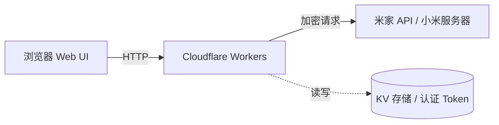
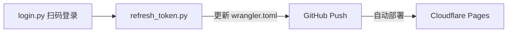

## 前言

我有一台放在家里的电脑，平时需要在无手机的情况下远程开机+sunshine串联。我的方案是：**用米家wifi开机卡（某多20多块一张，没有蓝牙网关要买WiFi款） + Cloudflare Workers部署网页**，零成本实现网页远程开机。

项目闭源在 GitHub（存储着token不便开源，~~其实是可以以环境变量的方式存储，但我懒~~）


## 整体架构

### 请求链路



### 开发 / 部署流程



项目分为两层：

### 1. 底层：`mijia-api`（Python 库）

这是一个开源的米家 API 封装库，基于对小米米家 APP 网络请求的逆向分析，实现了完整的米家设备控制协议。支持：

- **扫码登录**：通过米家 APP 扫描二维码完成身份验证
- **设备控制**：获取/设置设备属性（开关、亮度、模式等）
- **场景控制**：执行智能场景
- **Token 自动续期**：利用 `passToken` 静默刷新 `serviceToken`，无需频繁重新登录
- **MCP Server**：支持作为 MCP 工具接入 AI 助手

### 2. 上层：`mijia-web`（Cloudflare Workers）

这是一个部署在 Cloudflare 边缘网络上的 Web 应用，包含：

- **TypeScript Worker**：处理 API 请求、加密通信、调用小米接口
- **前端页面**：登录页 + 控制面板，简洁的移动端适配
- **KV 存储**：保存认证 Token，支持浏览器端一键刷新

## 技术亮点

### 1. 零服务器成本

整个 Web 应用部署在 Cloudflare Workers 上，免费额度足够个人使用（每天 10 万次请求）。通过 GitHub 自动部署，提交代码即上线。

### 2. 米家加密协议完整实现

米家 API 的请求需要经过多层加密：

- **RC4 流加密**：请求参数和响应数据用 RC4 加密传输
- **SHA-256 签名**：每次请求生成动态 nonce，用 `ssecurity` 计算签名
- **SHA-1 签名**：加密参数需额外签名校验

这些加密逻辑全部用纯 TypeScript 实现（`crypto.ts`），不依赖任何外部库，在 Cloudflare Workers 运行时中完美运行。

### 3. Token 自动续期

小米的 `serviceToken` 有效期约 30 天，过期后需要重新登录。但项目实现了**静默续期**机制：

- `login.py` 登录时不仅保存 `serviceToken`，还保存了 `passToken`
- 当 Token 过期时，Worker 调用小米的 `pass/serviceLogin` 接口，用 `passToken` 换取新的 `serviceToken` 和 `ssecurity`
- 整个过程**无需重新扫码**，一键完成

### 4. KV 存储 + 一键刷新

之前每次 Token 过期都需要在本地跑 `login.py`，然后手动更新环境变量并重新部署。现在：

1. 认证数据存储在 Cloudflare KV 中
2. 控制面板上有一个"**刷新 Token**"按钮
3. 点击后，Worker 自动完成续期并保存到 KV
4. 页面提示成功，全程无需离开浏览器

### 5. 前端安全

- 登录密码用 SHA-256 哈希验证
- Session Token 有 3 小时有效期，自动过期
- 支持 Bearer Token 和 Cookie 两种认证方式
- 密码通过环境变量配置，不硬编码在代码中

## 核心代码解析

### 小米加密请求

```typescript
// 生成动态 nonce（基于时间戳 + 随机数）
const nonce = genNonce();

// 用 ssecurity 对 nonce 签名
const signedNonce = await getSignedNonceAsync(ssecurity, nonce);

// 加密请求参数
const encParams = await generateEncParams(uri, 'POST', signedNonce, nonce, params, ssecurity);

// 发送加密请求
const response = await fetch(url, {
    method: 'POST',
    headers: {
        'User-Agent': userAgent,
        'Cookie': buildCookies(authData),
        'miot-encrypt-algorithm': 'ENCRYPT-RC4',
    },
    body: new URLSearchParams(encParams),
});
```

### Token 刷新

```typescript
// 用 passToken 调用小米登录接口
const resp = await fetch('https://account.xiaomi.com/pass/serviceLogin', {
    headers: {
        'Cookie': `passToken=${passToken}; userId=${userId}; ...`,
    },
});

// 解析响应，获取新的 ssecurity
const data = JSON.parse(text.replace('&&&START&&&', ''));
const newSsecurity = data.ssecurity;

// 跟随 location 获取新的 serviceToken
const resp2 = await fetch(location, {
    headers: { 'Cookie': `serviceToken=${oldToken}; ...` },
});

// 从 Set-Cookie 中提取新 token
// 保存到 KV
await env.MIJIA.put('auth_data', JSON.stringify(newAuthData));
```

## 部署流程

### 1. 安装依赖

```bash
pip install mijiaAPI
cd mijia-web && npm install
```

### 2. 扫码登录

```bash
python login.py
# 用米家 APP 扫描终端二维码
```

### 3. 配置 Cloudflare

在 Cloudflare Dashboard 创建一个 KV namespace `mijia`，然后将 ID 填入 `wrangler.toml`。

### 4. 部署

```bash
npm run deploy
```

之后每次 Token 过期，只需在网页上点击"刷新 Token"按钮即可。

## 效果展示


登录后进入控制面板，可以看到：

- 当前设备开关状态
- 开机/关机按钮
- 强制关机按钮
- **刷新 Token** 按钮（点击后自动续期）
- 退出登录

整个页面适配移动端，在手机上也能流畅操作。

## 技术栈


| 层级 | 技术 |
| ---- | ------------------------------- |
| 前端 | 原生 HTML + CSS + JavaScript |
| 后端 | TypeScript + Cloudflare Workers |
| 存储 | Cloudflare KV |
| 部署 | GitHub + Cloudflare workers |
| 设备控制 | mijia-api |
| 加密 | Web Crypto API + 纯 JS 实现 |


## 总结

这个项目展示了如何用 Cloudflare Workers 这种"无服务器"架构，结合逆向分析的米家 API，实现一个实用的远程控制工具。整个过程不需要公网 IP、不需要服务器、不需要额外付费，而且通过 Cloudflare 的全球边缘网络，响应速度极快。  
**米家api仓库**: [[https://github.com/Do1e/mijia-api](https://github.com/Do1e/mijia-api))